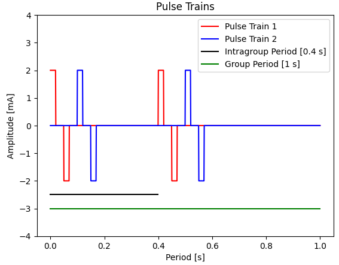

# Parameters

These parameters apply to all the channels. We are considering to support 2 channels in each node.

| #   | MASK | ID  | DEFAULT | TYPICAL  | UNITS | DESCRIPTION                         |
| --- | ---- | --- | ------- | -------- | ----- | ----------------------------------- |
| 0   | A    | AP  | 0       | 0 - 100  | mA    | Positive Amplitude                  |
| 1   | B    | AN  | 0       | 0 - 100  | mA    | Negative Amplitude                  |
| 2   | C    | TP  | 2       | 2 - 500  | μs    | Positive Time                       |
| 3   | D    | TN  | 2       | 2 - 500  | μs    | Negative Time                       |
| 4   | E    | FI  | 5       | 5 - 50   | Hz    | Intragroup Frequency\*              |
| 5   | F    | FG  | 5       | 5 - 50   | Hz    | Group Frequency\*                   |
| 6   | G    | TW  | 100     | 20 - 100 | μs    | Waiting Time between pulse polarity |
| 7   | H    | NP  | 1       | 1 - 4    | pkt   | Number of packets in the group      |

\*$FG \ge FI _ n*{pg}$; $n_{pg}$: Number of packets in the group between [1-4].

A packet is a group of pulse trains that appear one period of $1/FG$. For example, if you want to repeat pulse 1 at least 2 times inside the period, you must set NP from 1 to 2; in this case, when pulse 2 has finished, and the period is not complete, the pulse 1 will star again.

