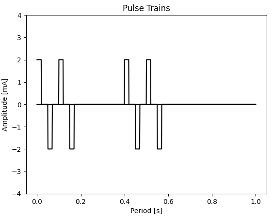

# Parameters

| #   | MASK | ID  | DEFAULT VALUE | TYPICAL    | UNITS | DESCRIPTION                         |
| --- | ---- | --- | ------------- | ---------- | ----- | ----------------------------------- |
| 0   | A    | AP  | 0             | 0 - 100 mA | mA    | Positive Amplitude                  |
| 1   | B    | AN  | 0             | 0 - 100 mA | mA    | Negative Amplitude                  |
| 2   | C    | TP  | 2             | 2 - 500    | μs    | Positive Time                       |
| 3   | D    | TN  | 2             | 2 - 500    | μs    | Negative Time                       |
| 4   | E    | FI  | 5             | 5 - 50     | Hz    | Intragroup Frequency                |
| 5   | F    | FG  | 5             | 5 - 50     | Hz    | Group Frequency                     |
| 0   | G    | TW  | 100           | 20 - 100   | μs    | Waiting Time between pulse polarity |

$$
FG \ge FI * n_{pg}
$$

$n_{pg}$: Number of packet group, [1-4]

